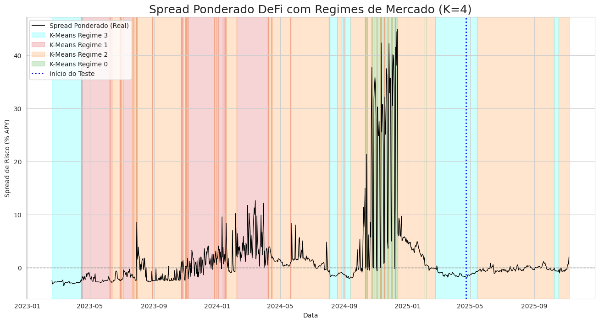

# 6-datathon-fgv-eesp
O Desafio de Dados (Datathon) de Moedas Digitais é uma iniciativa da FGV EESP que promove estudos e atividades em blockchain e inovações financeiras, além de promover a integração de estudantes de graduação de todo o Brasil.

# QUANTIFICANDO O RISCO DEFI VS RWA: MODELAGEM E PREVISÃO DO SPREAD

Este repositório contém a análise e os modelos desenvolvidos para o Datathon, focados em modelar e prever o spread de rendimento entre as Finanças Descentralizadas (DeFi) e os Ativos do Mundo Real (RWA) tokenizados.

- **PDF da Apresentação:** `Crypto.pdf`
- **Notebook Principal:** `datathon.ipynb`

## Contexto e Problema

O mercado de *Real World Assets* (RWA) representa a próxima fronteira da integração entre o sistema financeiro tradicional (TradFi) e as finanças descentralizadas (DeFi). Esta convergência cria dois tipos de rendimento competindo no mesmo ambiente on-chain:

1.  **Rendimento TradFi/RWA:** Derivado de ativos do mundo real, como Títulos Públicos (ex: a taxa SOFR).
2.  **Rendimento DeFi Nativo:** Gerado algoritmicamente por protocolos (ex: Aave, Compound) com base na demanda por alavancagem on-chain.

**O Problema:** Quais fatores explicam o spread de rendimento pago pelos protocolos DeFi (Aave/Compound) em comparação com a taxa "livre de risco" (SOFR) do sistema tradicional tokenizado?

**Nosso Target (Y):**
`Spread de Risco = Yield Ponderado de DeFi (Aave/Compound) - Yield de TradFi (SOFR)`

## Hipótese

O spread de juros observado não é aleatório. Ele funciona como um **"indicador de risco"** do ecossistema DeFi, e seus principais determinantes podem ser modelados por uma combinação de fatores on-chain (internos ao DeFi) e off-chain (mercado macro).

## Metodologia e Modelagem

Para testar a hipótese, desenvolvemos três abordagens de modelagem distintas:

### 1. Modelo Híbrido (K-Means + Regressão por Regime)

Esta foi nossa abordagem principal para interpretabilidade. A tese era que o spread se comporta de maneiras fundamentalmente diferentes dependendo do "regime de mercado".

**Passo 1: Identificação de Regimes (Clusterização)**
* Utilizamos o **K-Means (k=4)** para identificar padrões nos dados.
* **Prevenção de Data Leakage:** O K-Means foi treinado usando exclusivamente *features defasadas (t-1)*, garantindo que a classificação do regime de um dia só usa informações do dia anterior.
* **Estabilidade:** Para evitar ruídos diários, aplicamos um **Filtro de Moda Móvel Causal** (janela de 7 dias) aos labels do cluster, assegurando que o modelo só mude de regime após uma tendência consolidada.

**Passo 2: Previsão por Regime (Regressão)**
* Com os regimes identificados, treinamos um regressor especialista para cada cluster.
* Testamos `Random Forest`, `XGBoost`, `SVM` e `Regressão LASSO`.
* O **SVM** se mostrou o regressor mais robusto para os regimes de "Calma" e "Pânico TradFi" (Clusters 0 e 1), sendo o vencedor para o modelo final.

### 2. Modelo de Volatilidade (GARCH)

Para modelar o "risco" (volatilidade) em vez do "nível" do spread, usamos um modelo GARCH(1,1). A motivação foi o *clustering* de volatilidade observado nos deltas diários do spread.

### 3. Modelo de Deep Learning (TFT)

Para uma abordagem SOTA (Estado da Arte) focada puramente na precisão preditiva, utilizamos um **Temporal Fusion Transformer (TFT)**. Este modelo de *deep learning* é projetado para capturar relações complexas não-lineares em séries temporais, integrando múltiplos tipos de dados (históricos, futuros e estáticos).

## Análise de Resultados e Descobertas

Nossa análise de clusterização (ver slide 5, `image_1c8d24.jpg`) revelou os *drivers* por trás de cada regime de mercado, validando nossa hipótese principal.

* **Regime 0 (Verde): "O Novo Normal"**
    O estado de *baseline* do mercado. Caracterizado por uma **alta demanda crônica por alavancagem** (Utilização do Compound em 88.14 Z-score) e estresse moderado de VIX e Gás.

* **Regime 1 (Rosa/Vermelho): "Fuga para Segurança"**
    Este regime tem o **VIX mais alto** (Z-score 22.94), indicando **pânico nos mercados tradicionais**. Crucialmente, isso *não* causa um spike no spread DeFi; ao contrário, causa uma **fuga de capital** (Utilização cai para 70.43), fazendo o spread contra o RWA ficar negativo.

* **Regime 2 (Laranja): "Euforia On-Chain" (Sinal de Alerta)**
    Este é o **principal precursor da crise**. É definido por **taxas de Gás extremas** (Z-score 44.55) e **Utilização no limite** (Z-score 90.52). O sistema está superaquecido e congestionado.

* **Regime 3 (Azul): "Crise de Liquidez DeFi"**
    Este é o **pico do spread**. Ocorre *após* o Regime 2. O sistema "quebra" internamente, evidenciado pelo **disparo do spread Aave/Compound** (Z-score 34.11). A demanda por empréstimos supera massivamente a oferta, e o spread contra o RWA explode.

### Performance dos Modelos

| Modelo | R² (out-of-sample) | MAE | RMSE | Interpretabilidade |
| :--- | :---: | :---: | :---: | :---: |
| **Híbrido (K-Means + SVM)** | **0.6217** | 0.2475 | 0.3324 | **Alta** |
| **TFT (Deep Learning)** | **0.9120** | 0.766 | 2.05 | Baixa |

O **Modelo Híbrido** provou a tese de que o spread é movido por diferentes regimes, alcançando um R² robusto de **0.6217**. O **TFT** confirmou que o spread é, de fato, altamente previsível, alcançando um R² de **0.9120**.